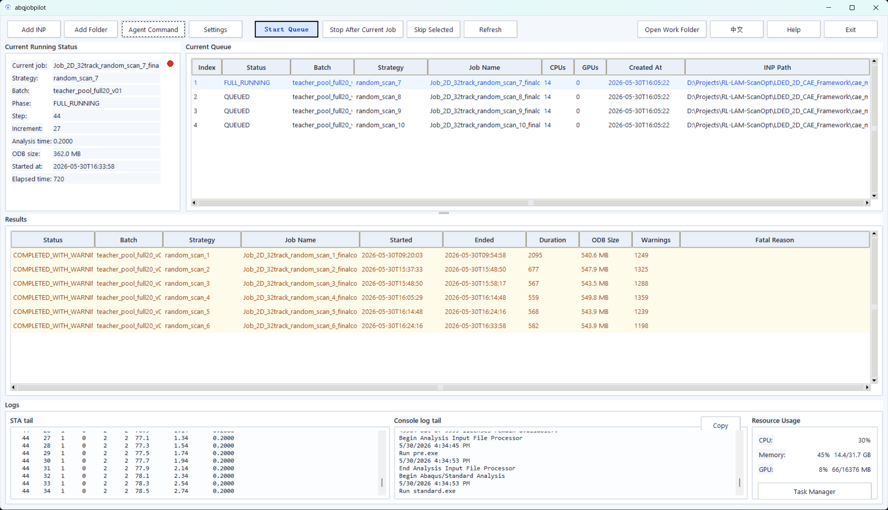

<h1 align="center">Abaqus Job Pilot</h1>

<p align="center"><strong>Agent-friendly Abaqus .inp queue runner and live monitor.</strong></p>
<p align="center"><strong>Batch upload, sequential execution, safe interruption, real-time STA/log diagnostics, and resource-aware job control.</strong></p>

<p align="center">
  <a href="README_CN.md">中文 README</a>
</p>

<p align="center">
  <a href="#"></a>
  <a href="#"></a>
  <a href="#"></a>
  <a href="#"></a>
  <a href="LICENSE"></a>
</p>



## Table Of Contents

- [Why abqjobpilot](#why-abqjobpilot)
- [Highlights](#highlights)
- [Quick Start](#quick-start)
- [Abaqus Command Path](#abaqus-command-path)
- [Agent Command Workflow](#agent-command-workflow)
- [Output Location](#output-location)
- [Safety Design](#safety-design)
- [Tests](#tests)
- [Roadmap](#roadmap)

## Why abqjobpilot

`abqjobpilot` is a standalone desktop tool for managing Abaqus `.inp` job queues. It is designed for simulation batches, parameter sweeps, strategy pools, and long-running research workflows where manually submitting jobs one by one wastes time and compute availability.

Many Abaqus batch workflows lose time because jobs are launched manually, failures are noticed late, or workstation resources sit idle overnight. `abqjobpilot` reduces that idle time through queue execution, datacheck-first workflow, live monitoring, resource visibility, and fast AI-assisted log diagnosis.

In batch simulation, parameter sweep, and strategy-pool generation workflows, it can improve effective compute throughput by roughly `15%-40%`, depending on job duration, machine configuration, queue size, and operator availability.

## Highlights

| Area | What It Provides |
| --- | --- |
| Batch queue | Add one `.inp` file or scan a folder for multiple `.inp` jobs. |
| Sequential execution | Run jobs one by one without manually launching each Abaqus job. |
| Datacheck-first workflow | Run `datacheck` before full analysis to catch input issues earlier. |
| Safe interruption | Use `Stop After Current Job` to stop the queue after the active job finishes. |
| Live monitoring | Watch phase, step, increment, analysis time, ODB size, `.sta` tail, and console log tail. |
| Result review | See completed, warning, and failed jobs in a separate result table. |
| Agent-friendly control | Paste AI-generated internal commands into the Agent Command Console. |
| Resource awareness | View CPU, memory, and GPU usage while jobs are running. |
| Local output style | Keep Abaqus `.odb`, `.sta`, `.msg`, `.dat`, and `.log` files beside the original `.inp`. |

## Quick Start

```powershell
git clone https://github.com/BrunelXian/abq_job_pilot.git
cd abq_job_pilot

python -m venv .venv
.\.venv\Scripts\activate

pip install -r requirements.txt
python run_gui.py
```

The current MVP uses only the Python standard library for core GUI functionality.

## Abaqus Command Path

Each workstation may have a different Abaqus installation path. Open `Settings` in the GUI and set the local Abaqus command, for example:

```text
D:\ABAQUS2024\Commands\abq2024.bat
```

Settings also include:

- default CPU count, such as `12` or `14`
- whether GPU is enabled
- default GPU count, such as `1`
- whether to run `datacheck`
- whether to run the full analysis

## Agent Command Workflow

The Agent Command Console is not a system shell. It only accepts a small whitelist of internal commands.

You can ask ChatGPT, Codex, Grok, or another AI assistant to generate queue commands, then paste them back into `abqjobpilot`.

```text
enqueue --inp "D:\path\Job_xxx.inp" --cpus 14 --gpus 1
enqueue-folder --folder "D:\path\strategy_folder" --pattern "*.inp"
list
help
clear
```

Example commands:

```text
enqueue --inp "D:\Projects\models\batch_a\strategy_01\Job_test.inp" --batch batch_a --strategy strategy_01
enqueue --inp "D:\Projects\models\batch_b\strategy_02\Job_test.inp" --cpus 12 --gpus 1
enqueue-folder --folder "D:\Projects\models\batch_c\strategy_03" --pattern "*.inp"
list
```

Console workflow:

- `Copy AI Prompt`: copy the command-generation instruction for an AI assistant.
- `Paste`: import generated commands from the clipboard.
- `Paste & Run`: import and execute commands immediately.
- Omit `--cpus` or `--gpus` to use Settings defaults.

## Output Location

Abaqus runs in the `.inp` file's folder, so solver output files are created there:

```text
*.odb
*.sta
*.msg
*.dat
*.log
```

`abqjobpilot` runtime metadata is stored under:

```text
runtime/
```

Runtime files, virtual environments, and large Abaqus output files are ignored by git.

## Safety Design

- The Agent Command Console parses only whitelisted internal commands.
- It does not execute arbitrary PowerShell, cmd, Python, or shell commands.
- Abaqus jobs start only after the user clicks `Start Queue`.
- The runner avoids `shell=True` for Abaqus execution.

## Tests

```powershell
python -m unittest discover -s tests -v
```

Tests do not submit Abaqus jobs.

## Roadmap

- Finer failure classification: license, input, numerical, interrupted.
- Resume and rerun workflows.
- More modern GUI theme.
- Optional SQLite queue backend.
- Packaged Windows release.
